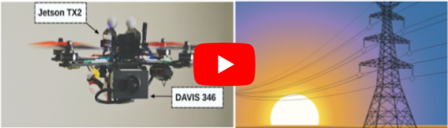

# Line Tracking with Event Cameras

[](https://www.youtube.com/watch?v=KnBJqed5qDI)

## Publication
If you use this code in an academic context, please cite the following [IROS 2021 paper](http://rpg.ifi.uzh.ch/docs/IROS21_Dietsche.pdf).

A. Dietsche, G. Cioffi, J. Hidalgo-Carrio and D. Scaramuzza,
"**Power Line Tracking with Event Cameras**,"
IEEE/RSJ Int. Conf. Intell. Robot. Syst. (IROS). 2021.

```
@InProceedings{Dietsche2021
  author = {Dietsche, Alexander and Cioffi, Giovanni and Hidalgo-Carrio, Javier and Scaramuzza, Davide},
  title = {Power Line Tracking with Event Cameras},
  booktitle = {IEEE/RSJ Int. Conf. Intell. Robot. Syst. (IROS)},
  year = {2021}
}
```

## Installation
1. Clone the [rpg_dvs_ros](https://github.com/uzh-rpg/rpg_dvs_ros) repository and add the *dvs_msgs* package to your workspace.
2. Clone this repository and add it to your workspace.
3. Build the tracker:
```
catkin build line_event_tracker 
```
4. If you want to visualize the lines, build the visualization package as well:
```
catkin build line_event_tracker_visualizer
```

## Parameter Tuning
The parameters and their description can be found [here](https://github.com/uzh-rpg/line_tracking_using_event_cameras/blob/main/line_event_tracker/param/param.yaml).

## Undistort
The tracker performs much better on undistorted events. To that end, a undistort step was added. The camera parameters need to be defined in the *run.launch* file.
For visualization package needs the camera parameters defined separately in their *run.launch* file.

## Run
To run the tracker:
```
roslaunch line_event_tracker run.launch
```

To run the tracker with the visualization:
```
roslaunch line_event_tracker run_with_visualizer.launch
```